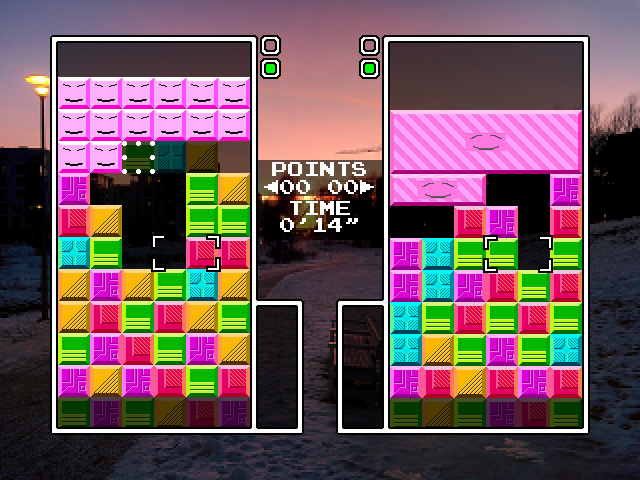

# 2018-2-OSSP-panelpopGameAI
panel-pop game AI with Genetic Algorithm 

## Original version:
* A Panel de Pon / Tetris Attack / Puzzle League clone made with C++ and SDL by a544jh
* https://github.com/a544jh/panel-pop

## Features:
* Original-like mechanincs modeled after SNES version
* Additional visual gameplay tweaks
* Single player endless mode
* Smart AI learned by Genetic Algorithm
* Two-player VS game with garbage blocks
* Only for Linux

## Controls

Default gameplay keys:
* Arrow keys - move cursor
* `X` - accept/swap blocks
* `Z` - cancel/raise stack
* `5` - pause/start

Debug keys:
* `Esc` - reset boards
* `1`,`2`,`3`,`4`,`6`,`7`,`8` - drop garbage block

Misc:
* `Ctrl`+`F` - toggle fps diplay
* `Alt`+`Return` - toggle fullscreen

## How to build
#### Dependencies
* cmake
* SDL2
* SDL2_image
* SDL2_ttf
* SDL2_mixer
* boost

#### Linux
1. `cmake`
2. `make`

#### MacOS
1. `cmake`
2. `make`

#### Windows (MinGW)

1. `cmake -G "MinGW Makefiles" -DCMAKE_SH="CMAKE_SH-NOTFOUND"`
2. `mingw32-make.exe`

#### DONGGUK UNIVERSITY, Seoul, Republic Of Korea
